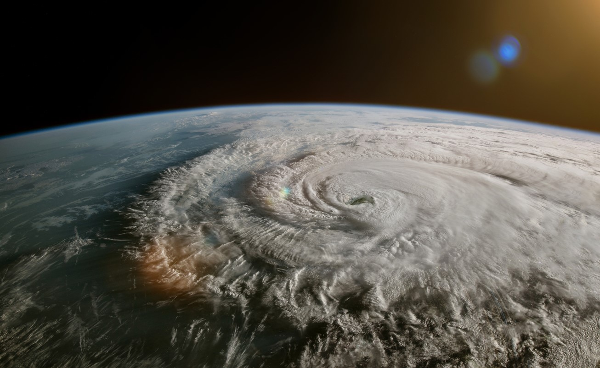

# ACTL4001/ACTL5100 SOA Challenge Showcase

Team: WeCare

Team Members: Justin Khaw | Michele Lin | Amaan Mohideen | Jason Xue

>insert table of contents?? -JK

---
<h2 align="left">Executive Summary</h2>

WeCare has been hired to design a social insurance program for Storslysia with the ultimate goal of managing its exposure to displacement risk arising from catastrophic climate related events. WeCare is proposing a three-pronged approach:

- Providing property coverage for those affected by natural catastrophes
- Temporary accommodation and payments to cover displacement living costs
- Monetary grant incentives to promote proactive relocation to lower risk areas

Participation in this program will be compulsory and consists of individualised risk pricing for the six main regions of Storslysia. Catastrophes frequency and severity were projected to provide a measure of property damage for all regions. WeCare is confident the proposed social insurance program will be sustainable over the projected 127-year timeframe with an annual review process to monitor and revise assumptions. This report provides a risk assessment and mitigation framework to support Storslysia to manage its exposure to catastrophic climate related events

---
<h2 align="left">Objectives</h2>

Increasing temperatures and rising sea levels have been experienced worldwide due to increasing greenhouse gas emissions (EPA, Climate Change Indicators: Oceans 2022). Around the world the frequency and intensity of natural catastrophes are growing at an alarming rate. For the residents of Storslysia, its diverse geography exposes them to a range of different catastrophic events. The impacts of climate change have elevated the population's risk of displacement and not having home insurance in this current environment is a cause for concern (iDMC, Displacement, disasters and climate change 2021). WeCare’s objective is to design a social insurance program to protect Storslysian households against this displacement risk. Our proposal possesses similar features to home insurance, by compensating homeowners financially to repair/replace their home when damaged by an insured catastrophic event. The scheme aims to provide affordable mandatory home insurance, coverage of temporary housing and living costs and incentives to encourage proactive relocation to less risky regions to the residents of Storyslysia.

<h3 align="left">Key Metrics to Monitor</h3>

|Metric |Aim  |Reporting Frequency  |
|:----- |:--- |:---                 |
| Proportion of displacements| Reduce % of population displaced  |Bi-annually  |
| Property Damage            | Lower levels of property damage   | Annually    |
| Proportion of relocations| Increased number of incentivise relocations  |Annually  |
| Actuals vs Expected claims (frequency & severity)|  Monitor program performance |Bi-annually  |
| Expenses           |  Track expenses (operational & admin)  | Annually    |

---
<h2 align="left">Design</h2>
WeCare proposes a 3-part insurance program targeted at reducing the impact of potential catastrophic events and relocation.

1. Home insurance cover for catastrophic events for all homeowners.
2. Temporary displacement insurance to cover the costs of temporary relocation due to extreme hazard events.
3. Monetary grant incentives for households to purchase property in the safest region in Storslysia.

<h3 align="left">Policy Coverage</h3>

*Damages which are covered:*

Residential building damages due to:
- Coastal
- Storm
- Hurricane
- Tornado
- Flooding
- Heat/Drought
- Winter weather
- Hail

*Damages which are **not** covered:*

- Earthquake damages
- Tsunami damages
- Landslide damages
- Damages due to man-made disasters e.g war, terrorism, inadequate maintenance, theft, house fires etc.
- Personal injury costs
- Home contents
- Business Interruption
- Non-residential buildings

After a successful claim, the program will cover the cost of:

- Temporary accommodation, which includes a fortnightly living cost payment for displacement caused by natural disasters.
- Rebuilding, repairing, or replacing damages to homes caused by insured natural hazards.

---
<h2 align="left">Pricing and Costing</h2>

>insert section

---
<h2 align="left">Assumptions</h2>

>insert section

---
<h2 align="left">Risks</h2>

>insert section

---
<h2 align="left">Data and Data Limitations</h2>

WeCare has received the following data: 

|**Dataset**| **Description**| **Usage** |
|:---|:---|:---|
|Historical Hazard Events |Contains hazard data from 1960 to 2020| Main input for the property damage cost projection|
|Demographic / Economic data |Contains census and economic data split by region| Main use was in the projection of temporary relocation costs and discounting of cash flows.|
|Greenhouse emissions data| Contains future projections of carbon emissions and frequency projection model| Main use was in the sensitivity analysis of costs and projection of the frequency of hazard events|

In analysis of the data provided, the following limitations were faced:

**Inaccuracy**

Historical inflation and interest data provided had missing, invalid or unrealistic values which limits the accuracy of our results. Values were adjusted by using the average of 2 years of adjacent values.

**Lack of granularity**

The demographic/economic data lacks breakdown of categories such as population structure, living costs and property. Some data point originated from past years such as 2017 could be potentially outdated and irrelevant. WeCare has worked around these data issues by creating reasonable assumptions in our modelling and analysis to limit the data quality’s impact on our cost benefit analysis.

Due to lack of data, a flat 5% assumption was made on expenses however assumptions on reinsurance expenses, stamp duty, or GST were not made.

**Sample size**

The accuracy of our modelling and projection is highly dependent on the data used. Although hazard data dates back to 1960, the sample size is small (~3000 rows) due to the extreme nature of events, hence impacting overall model precision.

**External forces and scope of data**

WeCare’s analysis is bounded by the data available at the time of analysis. The uncertainty of the global environment may make current projections irrelevant. WeCare recommends that Storslysia re-evaluates these projections annually for the next 10 years and every 5 years afterwards.

---
>Below is to delete

#### Follow the [guide doc](Doc1.pdf) to submit your work. 
---
>Be creative! Feel free to link to embed your [data](hazard-event-data.csv), [code](sample-data-clean.ipynb), [image](unsw.png) here

More information on GitHub Pages can be found [here](https://pages.github.com/)

