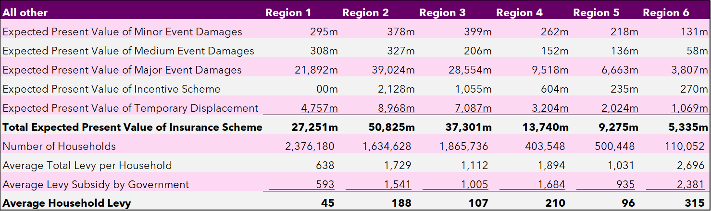
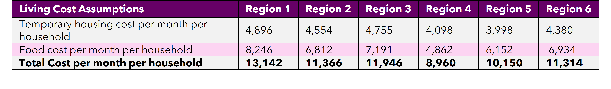
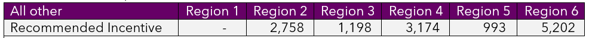
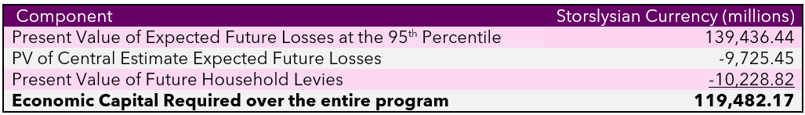
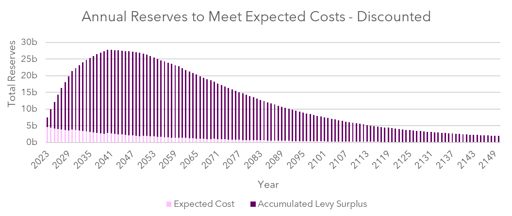
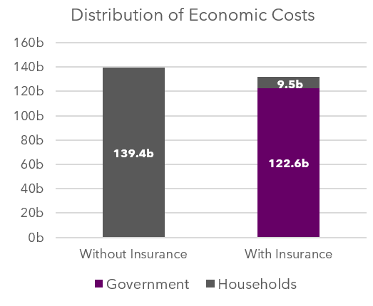
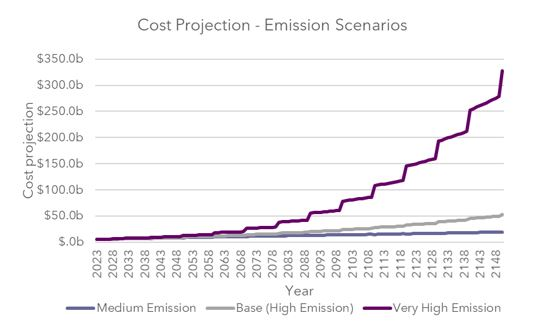
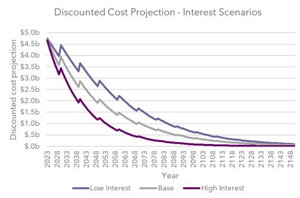

# ACTL4001/ACTL5100 SOA Challenge Showcase

Team: WeCare

Team Members: Justin Khaw | Michelle Lin | Amaan Mohideen | Jason Xue

---

# Table of Contents
1. [Executive Summary](#ExecutiveSummary)
2. [Objectives](#Objectives)
3. [Design](#Design)
4. [Pricing and Costing](#Price)
5. [Assumptions](#Assumption)
6. [Risks](#Risk)
7. [Data and Data Limitations](#Data)

---

<h2 align="left">1. Executive Summary</h2>

WeCare has been hired to design a social insurance program for Storslysia with the ultimate goal of managing its exposure to displacement risk arising from catastrophic climate related events. WeCare is proposing a three-pronged approach:

- Providing property coverage for those affected by natural catastrophes
- Temporary accommodation and payments to cover displacement living costs
- Monetary grant incentives to promote proactive relocation to lower risk areas

Participation in this program will be compulsory and consists of individualised risk pricing for the six main regions of Storslysia. Catastrophes frequency and severity were projected to provide a measure of property damage for all regions. WeCare is confident the proposed social insurance program will be sustainable over the projected 127-year timeframe with an annual review process to monitor and revise assumptions. This report provides a risk assessment and mitigation framework to support Storslysia to manage its exposure to catastrophic climate related events.

---

<h2 align="left">2. Objectives</h2>

Increasing temperatures and rising sea levels have been experienced worldwide due to increasing greenhouse gas emissions **(EPA, Climate Change Indicators: Oceans 2022)**. Around the world the frequency and intensity of natural catastrophes are growing at an alarming rate. For the residents of Storslysia, its diverse geography exposes them to a range of different catastrophic events. The impacts of climate change have elevated the population's risk of displacement and not having home insurance in this current environment is a cause for concern **(iDMC, Displacement, disasters and climate change 2021)**. WeCare’s objective is to design a social insurance program to protect Storslysian households against this displacement risk. Our proposal possesses similar features to home insurance, by compensating homeowners financially to repair/replace their home when damaged by an insured catastrophic event. The scheme aims to provide affordable mandatory home insurance, coverage of temporary housing and living costs and incentives to encourage proactive relocation to less risky regions to the residents of Storslysia.

<h3 align="left">2.1 Key Metrics to Monitor</h3> 

|Metric |Aim  |Reporting Frequency  |
|:----- |:--- |:---                 |
| Proportion of displacements| Reduce % of population displaced  |Bi-annually  |
| Property Damage            | Lower levels of property damage   | Annually    |
| Proportion of relocations| Increased number of incentivise relocations  |Annually  |
| Actuals vs Expected claims (frequency & severity)|  Monitor program performance |Bi-annually  |
| Expenses           |  Track expenses (operational & admin)  | Annually    |

---

<h2 align="left">3. Design</h2>

<h3 align="left">3.1 Overview</h3>
WeCare proposes a 3-part insurance program targeted at reducing the impact of potential catastrophic events and relocation.

1. Home insurance cover for catastrophic events for all homeowners.
2. Temporary displacement insurance to cover the costs of temporary relocation due to extreme hazard events.
3. Monetary grant incentives for households to purchase property in the safest region in Storslysia.

<h3 align="left">3.2 Home Insurance</h3>

<h3 align="left">3.2.1 Policy Coverage</h3>

*Damages which are covered:*

Residential building damages due to:
- Coastal
- Storm
- Hurricane
- Tornado
- Flooding
- Heat/Drought
- Winter weather
- Hail

*Damages which are **not** covered:*

- Earthquake damages
- Tsunami damages
- Landslide damages
- Damages due to man-made disasters e.g war, terrorism, inadequate maintenance, theft, house fires etc.
- Personal injury costs
- Home contents
- Business Interruption
- Non-residential buildings

After a successful claim, the program will cover the cost of:

- Temporary accommodation, which includes a fortnightly living cost payment for displacement caused by natural disasters.
- Rebuilding, repairing, or replacing damages to homes caused by insured natural hazards.

<h3 align="left">3.2.2 Scheme Claim Requirements</h3>

The following is required for a claim to be accepted:

• **Policy Adherence** - Claim needs to be covered by the scheme **(3.2.1)**

• **Event Classification** - Damages need to coincide with a Storslysian Bureau of Meteorology (SBM) classified natural hazard event.

• **Proof of loss** - Documentation or evidence to support a claim, such as photographs, videos, and/or receipts for damaged property. This may also include quoted estimates for repair or replacement costs.

• **Timely Submission** - Claims must be filed within 6 months from the last day recorded of the extreme hazard event.

<h3 align="left">3.3 Temporary Displacement Insurance</h3>

This scheme will cover the daily housing and living expense requirements in the event of displacement due to SBM classified natural hazards **(DFAT, Why we manage displacement and resettlement)**. Citizens must also prove property damage deeming the residential building unsafe to live in or inability to access the property with policy coverage consistent with home insurance **(3.2)**.

<h3 align="left">3.4 Voluntary Relocation Incentives</h3>

Part one of this scheme offers a lump sum to household owners in Regions 2 - 6, as an incentive to purchase properties in Region 1. The purpose being to encourage voluntary relocation to the safest area in Storslysia (Region 1), which has a significantly lower exposure to natural disaster events than all other regions. Part two is that household levies are priced based on the regional risk exposure. Therefore, households would benefit by relocating to a safer region and paying lower levies.

<h3 align="left">3.4.1 Scheme Specifications</h3>

• Households will pay lower annual levies for residing in safer regions.

• Region 2 - 6 households will receive a lump sum fund if they relocate to Region 1. The more exposed the current region is to climate events, the greater the lump sum offered to relocate.

• To receive this fund, homeowners must have purchased the home within an eligible region prior to 31st December 2022.

<h3 align="left">3.5 Other Features</h3>

• Our program will include the establishment of conservation areas which will be used for temporary accommodation.

• Levies may be reimbursed or reduced if the government is making significant profits due to the non-for-profit nature of the scheme.

<h3 align="left">3.5.1 Feature Justification</h3>

**Relocation incentive:** It is evident that different regions have differing risk profiles. For example, region 2 is 3 times more likely to experience a catastrophe then region 6 due to its coastal location ****. Therefore, for Storslysia to reduce overall losses from catastrophes, WeCare recommends voluntary relocation before disasters hit. Lumpsum incentives support citizens in the transition to safer regions thereby reducing involuntary displacement and property damage. Additionally, the criteria of residing in an eligible region before policy announcement deters citizens from taking advantage of the scheme and purchasing property in high risk areas to obtain the incentive lump sum.

**Home insurance:** Introducing annual levies helps to maintain the on-going longevity of the scheme. Citizens will need to consider the additional annual cost of owning a home in risky regions particularly when purchasing a home after the lumpsum incentive date. Finally, limiting cover to natural disasters reported by SBM aims to ensures sufficient data in modelling. Timely submission is also important to confirm damages are caused by relevant disasters.

**Temporary housing and living cost scheme:** This protect citizens’ basic universal right to shelter even in situations completely out of their control **(United Nations, The human right to adequate housing 2019)**. Overall, this scheme aims to ensure the social stability of Storsylsia despite the growing climate risk.

---

<h2 align="left">4. Pricing and Costing</h2>

<h3 align="left">4.1 Overview</h3>

The most significant cost driver for the relocation program is property damage. WeCare’s models estimate the expected annual aggregate loss using the historical property losses due to extreme events from 1960 to 2022. This data was split into minor, medium and major events using inflation-adjusted property damage per hazard ****. The relocation incentive and temporary displacement schemes are the other drivers of cost projections ****.

Through exploratory analysis, WeCare determined it is appropriate to model the cost of property damage by each region. These regions have unique exposures to natural events with varying degrees of severity that should be examined separately. The division of hazard events by region is also useful when it comes to levy setting, as it becomes a grading factor for determining the equitable price for each household. The Storslysian government has allocated a budget of 10% of GDP (~130b) to fund this program. WeCare proposes that the excess of budget required will be funded by an annual levy system to ensure sufficient capital to meet climate hazard risks. The following table summarises the levies under the proposed program.

<h3 align="left">4.2 Temporary Displacement</h3>

For those unable to live in their current home due to catastrophes, the scheme has accounted for the cost of temporary displacement. This cost is broken into two components:

- Temporary accommodation
- Living costs

The costs of temporary accommodation for Storslysia has been estimated under the assumption that the number of people displaced each year is correlated to the percentage of property damaged each year per region. WeCare assumed minor catastrophes do not cause enough property damage to claim temporary accommodation and living costs. WeCare has taken a conservative approach and assumed 12 months of temporary accommodation and living costs for major catastrophes and 3 months for medium catastrophes.

<h3 align="left">4.3 Incentive Program</h3>

Costs under voluntary relocation is projected to be lower than emergency displacement. Voluntary relocation significantly diminishes the exposure to property damage and reduces the need for temporary accommodation and living costs. The program promotes household to move from high risk regions to region 1 with once off cash incentives, as shown below.

These cash incentive can help households pay up to 20 years of future levy, while also reducing the total cost of each region as a result of voluntary relocation ****.

<h3 align="left">4.4 Economic Capital and Benefits</h3>

WeCare has conducted analysis on the level of liquidity required to remain solvent during the entirety of the program as well as the economic benefit created.

<h3 align="left">4.4.1 Economic Capital</h3>

An appropriate level of economic capital is required to ensure the social insurance program remains solvent. This means that at any given time there must be sufficient capital to cover the future cost of the program. The Storslysian government wants to protect its households even in the worst cases of natural hazards with a high degree of confidence. As a result, the program was priced based on the expected future losses at the 95% confidence bound. Additionally, WeCare has forecasted the impact of climate change on claim frequency using the worst-case emissions scenario.

The table below shows the estimated present value of the total economic capital required for the entirety of the program.

The economic capital will be spread across the life of the program through the annual levy, which has been priced to ensure Storslysia has a high confidence in the level of reserves assigned to meet catastrophe claims. Below is a graph which highlights the annual surplus maintained to avoid insolvency:

<h3 align="left">4.4.2 Economic Benefit Projection</h3>

Due to the very conservative approach taken to price this insurance program, WeCare has projected the economic benefits of the program under the same basis. Assuming climate events occur at the 95th percentile of expected damage, the Storslysian economy stands to benefit by reducing the overall present value of expected hazard losses by 7.330 billion units of Storslysian currency. Additionally, 92.8% of the burden of losses will be covered by the Storslysian government.

---

<h2 align="left">5. Assumptions</h2>

**Minor, medium, and major hazard categorization:**
The hazard events are split using breakpoints of 500,000 and 5,000,000 of discounted property damage per hazard event ****.

**Duration of displacement due to natural disaster:**
To estimate the total cost of temporary relocation, it was assumed that minor, medium, and major hazard events have varying durations of displacement ****.

**Percentage of population and households displaced**
Due to limited data surrounding displacement, the percentage displaced is assumed to be proportional to property damage as a percentage of total property value ****.

**Affordable premium boundary:**
The design of this social insurance program had affordability in mind throughout. Home insurance premium will be considered unaffordable when it exceeds four weeks of gross household income **(Paddam, S. et al)**, therefore, levies shall not exceed this.

**Population growth rate is assumed to be 1.6% per year:**
Demographic data shows 7% increase in population from 2020 to 2021. However, this growth is unsustainable long-term. Hence, WeCare assumes a constant 1.6% population growth using a basket of different annual growth rate indicators ****.

**Uniformity assumption:**
Due to limited data, an uniformity assumption was made where all buildings and people are impacted equally.

**Incentive scheme relocation rate:**
The model assumes 1% of households relocate to Region 1 annually.

---

<h2 align="left">6. Risks</h2>

**Risk Mitigation**
Risk |Mitigation |
|:----- |:--- |
|A. High claims cost: Increased emissions causing greater frequency and severity of catastrophic events and potential unforeseen climate issues.    Being a social program, we wish to maximise coverage, therefore do not want to limit policy coverage. |Stress testing climate worsening to the 95th percentile to ensure solvency.   Future scope:  •	Reinsurance to pool the risk.  •	Introducing an excess on property damage  •	Alternative measures to reduce climate effects e.g. researching renewable energy, reducing carbon emissions and back burning wildfires.
|B. Moral Hazard: If citizens believe their home is covered through the scheme, they may be less likely to take measures to minimise damages or voluntarily re-locate.   For example, well maintained roofs are less likely to be damaged by hail and storms, causing leaks and other damages.|Incentives to relocate to lower risk areas. Cross subsidisation between regions.   Future scope:  •	Incentive for home health checks e.g. a home maintenance voucher.  •	Extra data collected to improve the risk model.
|C. Adverse selection: Citizens with high risk are more likely to purchase the scheme| Making this scheme mandatory for all homeowners will mitigate this risk.
|D. Economic: Adverse interest rate & inflation	|Sensitivity testing for economic factors
|E. Affordability: Houses can be expensive. As potential risk of major disaster increases, levies can become too high to be affordable|	Levy max cap set to 8% of median household income ****.
|F. Operational & Administrative risk: Being a national scheme for all residential housing may be large administrative strain	|Allocate sufficient expenses towards operational and admin staffing (included in the expense loading)
|G. Actuarial Risk: Risk that assumptions and pricing models are inaccurate |•	Calibrate and monitor model frequently  •	Gather Input from experts  •	Encourage risk sharing with re-insurance  •	Exclude cover we do not have data for
|H. Data risk: Data may be skewed, incomplete or inaccurate	|•	Data checks done frequently  •	Update data regularly
|I. Liquidity risk: Insufficient funds for solvency	|Model economic funds to 95% confidence bound

<h3 align="left">6.1 Risk Matrix</h3>

<h3 align="left">6.2 Sensitivity Analysis</h3>

Sensitivity analysis is used to identify which variables have large individual influence on output. In this section we look at 2 key variables, emissions and interest.

**1. Higher/lower emissions scenarios**  • Leads to higher frequency of catastrophes  • Increased temporary accommodation needs  • Increased duration of displacement (months)  As seen in emission scenarios, there is much higher upside risk where very high emissions could cause costs to increase dramatically.
 

 

**2. Discounting (Economic Downturn)**  • Higher % on living expenses (15% | base 10%)  • Higher Interest (+/-2%) The interest scenario on the right demonstrates a relativity even impact from changes in interest rates
 

 

**3. Other variables tested with smaller impacts on results:**  • Incentive amount  • % of people relocating  • Reasonable population growth

---

<h2 align="left">7. Data and Data Limitations</h2>

WeCare has received the following data: 

|**Dataset**| **Description**| **Usage** |
|:---|:---|:---|
|Historical Hazard Events |Contains hazard data from 1960 to 2020| Main input for the property damage cost projection|
|Demographic / Economic data |Contains census and economic data split by region| Main use was in the projection of temporary relocation costs and discounting of cash flows.|
|Greenhouse emissions data| Contains future projections of carbon emissions and frequency projection model| Main use was in the sensitivity analysis of costs and projection of the frequency of hazard events|

In analysis of the data provided, the following limitations were faced:

**Inaccuracy**

Historical inflation and interest data provided had missing, invalid or unrealistic values which limits the accuracy of our results. Values were adjusted by using the average of 2 years of adjacent values.

**Lack of granularity**

The demographic/economic data lacks breakdown of categories such as population structure, living costs and property. Some data point originated from past years such as 2017 could be potentially outdated and irrelevant. WeCare has worked around these data issues by creating reasonable assumptions in our modelling and analysis to limit the data quality’s impact on our cost benefit analysis.

Due to lack of data, a flat 5% assumption was made on expenses however assumptions on reinsurance expenses, stamp duty, or GST were not made.

**Sample size**

The accuracy of our modelling and projection is highly dependent on the data used. Although hazard data dates back to 1960, the sample size is small (~3000 rows) due to the extreme nature of events, hence impacting overall model precision.

**External forces and scope of data**

WeCare’s analysis is bounded by the data available at the time of analysis. The uncertainty of the global environment may make current projections irrelevant. WeCare recommends that Storslysia re-evaluates these projections annually for the next 10 years and every 5 years afterwards.
